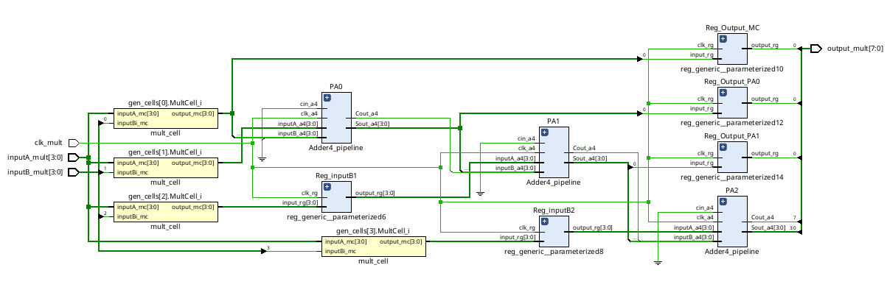
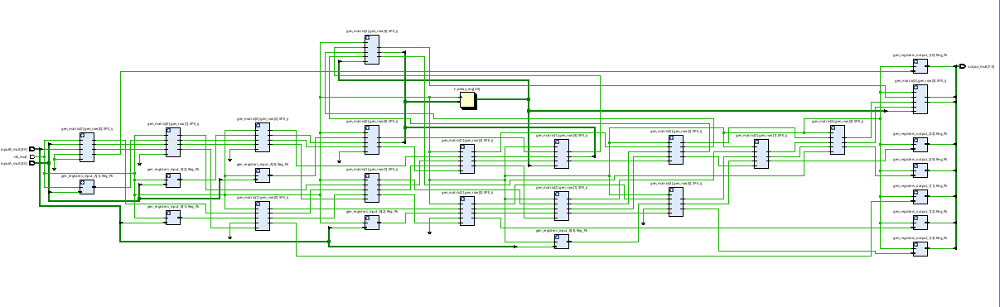

# 4-Bit Pipelined Multiplier Project

This repository contains the VHDL implementation of two high-performance 4-bit multipliers. The project explores the principles of **pipelining** and **systolic architectures** to optimize throughput in digital circuits.

## What is Pipelining?

Pipelining is a technique used in digital system design to increase the **throughput** (the number of operations completed per unit of time) of a circuit. Instead of waiting for a single multiplication to complete through all its logic gates, the operation is broken down into smaller stages separated by registers (flip-flops).

## Implementation Approaches

This project implements the multiplier using two distinct methods:

## 1. Normal Pipelining Multiplier (Mult.vhd)

This implementation follows a traditional structural approach to pipelining:

Structure: It uses a mult_cell to generate partial products and a Adder4_pipeline component to sum them.

Synchronization: To keep the signals aligned as they move through different stages of the addition, specific delays are added using a generic register component (reg_generic).

Characteristics: This approach is straightforward for small-scale designs but can lead to complex routing as the number of bits increases.

*RTL Schematic:*

## 2. Systolic Pipelining Multiplier (Mult_systolic.vhd)

The systolic implementation uses a more advanced and regular architecture:

Processing Elements (PE): The design is built from a grid of identical systolic_pe units.

Data Flow: Inputs A and B, along with partial sums and carry signals, "pump" through the array of PEs rhythmically at every clock cycle (similar to a biological systolic system).

Modular Design: Every PE contains its own internal registers, meaning data only moves between adjacent cells.

*Advantages*:

Scalability: Because of its regular 2D matrix structure, it is easily scalable to higher bit-widths (e.g., 8-bit, 16-bit).

Performance: Since signals only travel short distances between neighbors, it minimizes wire delays, allowing for very high clock speeds in VLSI implementations.

*RTL Schematic:*

